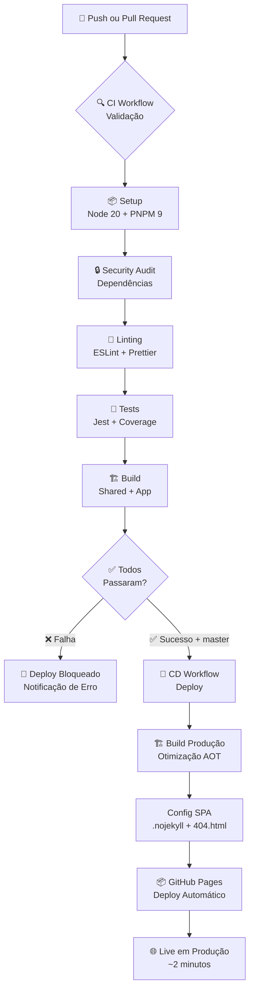

# 🏪 Angular Signals Store E-commerce - Monorepo Moderno

> **Ecossistema Angular 19 com arquitetura escalável, NgRx Signals e Design System reutilizável**

[](https://github.com/marcosram0s/wks-angular-challenge/actions)
[](https://marcosram0s.github.io/wks-angular-challenge/)
[](https://angular.io/)
[](https://ngrx.io/)
[](https://www.typescriptlang.org/)
[](https://pnpm.io/)
[](https://jestjs.io/)

---

## 🌐 Demo Live

🎯 **Aplicação em Produção**: [https://marcosram0s.github.io/wks-angular-challenge/](https://marcosram0s.github.io/wks-angular-challenge/)

> Configurei um pipeline CI/CD que faz deploy automático no GitHub Pages a cada push na `master`.

## 🎯 Visão Geral

Este projeto demonstra uma arquitetura Angular moderna utilizando **NgRx Signals** para gerenciamento de estado reativo, organizando uma aplicação de e-commerce em um **monorepo** com separação clara entre Design System e lógica de negócio.

### 🔑 Destaques Técnicos

- ✅ **Angular 19** com Signals nativos e nova sintaxe de controle de fluxo
- ✅ **NgRx Signals** para gerenciamento de estado type-safe e reativo
- ✅ **Standalone Components** sem NgModules
- ✅ **Atomic Design** na biblioteca compartilhada
- ✅ **Feature-Sliced Architecture** na aplicação principal
- ✅ **Monorepo** com workspaces PNPM para máxima reutilização

---

## 🏗️ Arquitetura do Monorepo

```
wks-angular-challenge/
│
├── projects/
│   │
│   ├── shared/                    # 🎨 Design System & Utilitários
│   │   ├── src/lib/ui/           # Componentes UI (Atomic Design)
│   │   │   ├── atoms/            # Elementos básicos (Button, Input, etc.)
│   │   │   ├── molecules/        # Composições (Card, Navbar, etc.)
│   │   │   ├── organisms/        # Seções complexas (Modal, Toast, etc.)
│   │   │   └── styles/           # Design Tokens & SCSS
│   │   │
│   │   └── src/lib/utils/        # Utilitários Compartilhados
│   │       ├── directives/       # Skeleton, Focus, etc.
│   │       ├── pipes/            # Transformações de dados
│   │       └── validators/       # Validadores de formulário
│   │
│   └── store-app/                # 🚀 Aplicação Principal
│       ├── src/app/core/         # Singletons e interceptadores
│       ├── src/app/features/     # Features isoladas
│       │   └── products/         # Feature de produtos
│       │       ├── components/   # Componentes específicos
│       │       ├── pages/        # Páginas inteligentes
│       │       ├── services/     # Serviços da feature
│       │       └── store/        # NgRx Signal Store
│       │
│       └── src/environments/     # Configurações
│
├── angular.json                  # Configuração do workspace
├── jest.config.js               # Configuração de testes
└── eslint.config.js             # Linting & qualidade
```

### 🧩 Separação de Responsabilidades

#### 📚 **Shared Library** - Design System Isolado

- **Propósito**: Biblioteca de componentes reutilizáveis seguindo Atomic Design
- **Benefício**: UI desacoplada da lógica de negócio, facilita manutenção e testes
- **Padrão**: `projects/shared/src/lib/ui/atoms/button/button.component.ts`

#### 🏪 **Store App** - Lógica de Negócio

- **Propósito**: Aplicação focada nas regras de negócio do e-commerce
- **Benefício**: Features isoladas com state management próprio
- **Padrão**: `projects/store-app/src/app/features/products/`

---

## 🔄 Gerenciamento de Estado com NgRx Signals

### Arquitetura de Estado

O projeto utiliza **NgRx Signals** em três níveis diferentes:

#### 1. **Global Stores** - Estado Compartilhado

```typescript
// Skeleton loading global
export const SkeletonStore = signalStore(
  { providedIn: 'root' },
  withState<SkeletonState>({ loading: false }),
  withMethods(store => ({
    show(): void {
      patchState(store, { loading: true });
    },
    hide(): void {
      patchState(store, { loading: false });
    }
  }))
);
```

#### 2. **Feature Stores** - Estado de Feature

```typescript
// Products store com estado completo
export const ProductsStore = signalStore(
  { providedIn: 'root' },
  withState<ProductsState>({
    allProducts: null,
    products: [],
    searchTerm: ''
  }),
  withComputed(store => ({
    filteredProducts: computed(() => {
      const source = store.allProducts();
      const term = store.searchTerm().toLowerCase();
      return source?.filter(p => p.title.toLowerCase().includes(term)) ?? [];
    })
  })),
  withMethods((store, productService = inject(ProductService)) => ({
    setSearchTerm: rxMethod<string>(
      pipe(
        debounceTime(300),
        tap(term => patchState(store, { searchTerm: term }))
      )
    )
  })),
  withHooks({
    onInit(store) {
      store.loadProducts();
    }
  })
);
```

#### 3. **Local Signals** - Estado de Componente

```typescript
// Component com signals locais
export class SelectComponent<T> {
  readonly isOpen = signal(false);
  protected readonly selectedOption = signal<SelectOption<T> | undefined>(undefined);

  toggleDropdown(): void {
    this.isOpen.update(open => !open);
  }
}
```

### 🔄 Padrões de Integração

#### Signals + RxJS com `rxMethod`

```typescript
setSearchTerm: rxMethod<string>(
  pipe(
    debounceTime(300), // Evita chamadas excessivas
    tap(term => patchState(store, { searchTerm: term })),
    switchMap(term => this.searchProducts(term))
  )
);
```

#### Effect para Reatividade

```typescript
constructor() {
  effect(() => {
    // Reage automaticamente a mudanças no signal
    this.productsStore.setSearchTerm(this.searchValue() ?? '');
  });
}
```

---

## 🎨 Design System - Atomic Design

### Hierarquia de Componentes

#### **Atoms** - Elementos Indivisíveis

```typescript
// projects/shared/src/lib/ui/atoms/button/
├── button.component.ts      # Lógica e interface
├── button.component.html    # Template
├── button.component.scss    # Estilos
├── models/                  # Tipos TypeScript
└── index.ts                 # Exportação
```

**Exemplo de Atom:**

```typescript
@Component({
  selector: 'lib-button',
  template: `
    <button [type]="type()" [disabled]="disabled()" [class]="buttonClass()">
      <ng-content />
    </button>
  `,
  changeDetection: ChangeDetectionStrategy.OnPush
})
export class ButtonComponent {
  variant = input<ButtonVariant>('primary');
  size = input<ButtonSize>('medium');
  disabled = input<boolean>(false);

  protected buttonClass = computed(() => `btn btn--${this.variant()} btn--${this.size()}`);
}
```

#### **Molecules** - Composições de Atoms

```typescript
// Card que combina múltiplos atoms
@Component({
  selector: 'lib-card',
  template: `
    <div class="card">
      <lib-image [src]="imageSrc()" [alt]="imageAlt()" />
      <div class="card__content">
        <h3>{{ title() }}</h3>
        <p>{{ description() }}</p>
        <lib-button (click)="action.emit()">
          {{ buttonText() }}
        </lib-button>
      </div>
    </div>
  `
})
export class CardComponent {
  title = input.required<string>();
  description = input<string>('');
  action = output<void>();
}
```

#### **Organisms** - Seções Complexas

```typescript
// Modal que orquestra múltiplas molecules/atoms
@Component({
  selector: 'lib-modal-right',
  template: `
    <div class="modal-overlay" (click)="closeModal()">
      <div class="modal-content" (click)="$event.stopPropagation()">
        <div class="modal-header">
          <h2>{{ title() }}</h2>
          <lib-button variant="ghost" (click)="closeModal()">×</lib-button>
        </div>
        <div class="modal-body">
          <ng-content />
        </div>
      </div>
    </div>
  `
})
export class ModalRightComponent {
  private modalStore = inject(ModalRightStore);

  title = input<string>('Modal');

  closeModal(): void {
    this.modalStore.close();
  }
}
```

---

## 🚀 Features e Organização

### Feature-Sliced Architecture

Cada feature é **totalmente isolada** e auto-contida:

```
features/products/
├── components/          # Componentes "dumb" (apresentação pura)
│   ├── form-manager/    # Formulário de produto
│   └── product-list/    # Lista de produtos
├── models/              # Interfaces e tipos
│   └── product.model.ts # Product, Category, ProductsState
├── pages/               # Páginas "smart" (orquestram lógica)
│   └── manager/         # Página principal de gerenciamento
├── services/            # Comunicação com API
│   └── products.service.ts
└── store/               # Estado da feature
    └── products.store.ts
```

### 🔄 Fluxo de Dados

#### 1. **Page Component** - Orquestra tudo

```typescript
@Component({
  selector: 'app-products-manager',
  template: `
    <div class="products-manager">
      <lib-input-search [formControl]="searchControl" />

      <app-product-list
        [products]="products()"
        [loading]="loading()"
        (editProduct)="editProduct($event)"
        (deleteProduct)="deleteProduct($event)" />
    </div>
  `
})
export class ProductsManagerComponent {
  private readonly productsStore = inject(ProductsStore);
  private readonly skeletonStore = inject(SkeletonStore);

  protected readonly products = computed(() => this.productsStore.products());
  protected readonly loading = computed(() => this.skeletonStore.loading());

  searchControl = new FormControl('');

  constructor() {
    effect(() => {
      this.productsStore.setSearchTerm(this.searchValue() ?? '');
    });
  }
}
```

#### 2. **Service** - Comunica com API

```typescript
@Injectable({ providedIn: 'root' })
export class ProductService extends BaseService {
  private readonly apiUrl = 'https://fakestoreapi.com/products';

  getAllProducts(): Observable<Product[]> {
    return this.http.get<Product[]>(this.apiUrl);
  }

  createProduct(product: Product): Observable<Product> {
    return this.http.post<Product>(this.apiUrl, product);
  }
}
```

#### 3. **Store** - Gerencia Estado

```typescript
export const ProductsStore = signalStore(
  { providedIn: 'root' },
  withState<ProductsState>({
    /* estado inicial */
  }),
  withComputed(store => ({
    /* computed values */
  })),
  withMethods((store, productService = inject(ProductService)) => ({
    loadProducts: rxMethod<void>(/* implementação */)
  })),
  withHooks({
    onInit(store) {
      store.loadProducts();
    }
  })
);
```

---

## 🛠️ Stack Tecnológica

### Core Framework

- **Angular 19.2** - Framework principal com Signals nativos
- **TypeScript 5.7** - Tipagem forte e recursos modernos
- **RxJS 7.8** - Programação reativa
- **NgRx Signals 20.0** - Estado reativo e type-safe

### Ferramentas de Desenvolvimento

- **PNPM** - Gerenciador de pacotes otimizado para monorepos
- **Jest 30.2** - Framework de testes rápido e moderno
- **ESLint 9.37** - Linting com regras Angular + unused-imports
- **Prettier 3.6** - Formatação automática
- **Husky 9.1** - Git hooks para qualidade

### Workflow & Automação

- **GitHub Actions** - Pipeline CI/CD automático
- **GitHub Pages** - Deploy automático em produção
- **Lint-staged** - Validação incremental em pre-commit
- **Conventional Commits** - Padrão de commits estruturados
- **Mermaid** - Diagramas de fluxo em documentação

### Características Modernas

- ✅ **Standalone Components** - Sem NgModules
- ✅ **Input/Output Signals** - `input()`, `output()` APIs
- ✅ **Novo Control Flow** - `@if`, `@for` em templates
- ✅ **Function-based DI** - `inject()` em vez de constructor
- ✅ **Signal-based Change Detection** - Performance otimizada

---

## 🚀 Scripts e Comandos

### Desenvolvimento

```bash
# Instalar dependências
pnpm install

# Iniciar aplicação (http://localhost:4200)
pnpm start

# Build de produção
pnpm build

# Build em modo watch
pnpm watch
```

### Testes

```bash
# Executar todos os testes
pnpm test

# Testes em modo watch
pnpm test:watch

# Testar apenas a biblioteca shared
pnpm test:shared

# Testar apenas store-app
pnpm test:store-app
```

### Qualidade de Código

```bash
# Linting com correção automática
pnpm lint

# Formatação com Prettier
pnpm format

# Verificar formatação
pnpm format:check
```

---

## 🛡️ Pipeline de Qualidade

### GitHub Actions CI/CD

O projeto utiliza **workflows automatizados** para garantir qualidade e deploy contínuo:

#### 📋 **CI Workflow** (`.github/workflows/ci.yml`)

```yaml
# Executa em: Push/PR para master/main
steps:
  - 📦 Setup: Node.js 20 + PNPM 9 + Cache
  - 🔒 Security: pnpm audit --audit-level moderate
  - 🧹 Linting: pnpm lint (ESLint + Prettier)
  - 🧪 Tests: jest --coverage --watchAll=false
  - 🏗️ Build: shared library + store-app
```

#### 🚀 **CD Workflow** (`.github/workflows/cd.yml`)

```yaml
# Executa apenas após CI bem-sucedido na master
steps:
  - 🏗️ Build: Produção com --base-href=/wks-angular-challenge/
  - 📄 SPA: Cria .nojekyll + 404.html para roteamento
  - 🌐 Deploy: GitHub Pages automático
```
### 🔄 Pipeline CI/CD



**📋 Resumo do Fluxo**:

| Etapa       | Arquivo                    | Ação                             | Tempo       |
| ----------- | -------------------------- | -------------------------------- | ----------- |
| **🔍 CI**   | `.github/workflows/ci.yml` | Validação completa de qualidade  | ~3-4 min    |
| **🚀 CD**   | `.github/workflows/cd.yml` | Build otimizado + Deploy         | ~1-2 min    |
| **🌐 Live** | GitHub Pages               | Aplicação disponível em produção | Instantâneo |

**🎯 Resultado**: Da aprovação do PR até produção em **menos de 5 minutos**!

---

### Pre-commit Hooks Automatizados

O projeto implementa um **sistema rigoroso de qualidade** que impede código problemático de entrar no repositório:

#### Fluxo de Validação

1. **Commit iniciado**: `git commit -m "feat: nova feature"`
2. **Husky intercepta**: Hook `pre-commit` acionado
3. **Lint-staged executa** para arquivos modificados:

**Para TypeScript (`.ts`):**

```bash
prettier --write    # Formatação
eslint --fix       # Correção de lint
jest --findRelatedTests  # Testes relacionados
```

**Para outros arquivos (`.html`, `.scss`, `.json`):**

```bash
prettier --write    # Apenas formatação
```

4. **Resultado**:
   - ✅ **Sucesso**: Commit realizado
   - ❌ **Falha**: Commit bloqueado com erros mostrados

### Benefícios

- 🚫 Código mal formatado nunca entra no repo
- 🐛 Bugs detectados antes do commit
- ⚡ Validação apenas de arquivos modificados
- 🤝 Consistência garantida em todo o código

### Benefícios do Pipeline

- 🛡️ **Qualidade Garantida**: Nenhum código quebrado vai para produção
- ⚡ **Deploy Instantâneo**: Mudanças live em ~2 minutos após merge
- 🔒 **Segurança**: Audit automático de dependências vulneráveis
- 📊 **Cobertura**: Relatórios de teste automáticos
- 🌐 **SPA Ready**: Configuração automática para roteamento Angular

---

## 📚 Conceitos-Chave Demonstrados

### 1. **Signal Store Pattern**

- Estado reativo com computed values
- Integração RxJS via rxMethod
- Type-safety completa
- Hooks de ciclo de vida

### 2. **Atomic Design Implementation**

- Hierarquia clara: Atoms → Molecules → Organisms
- Reutilização máxima de componentes
- Design tokens centralizados
- Testes isolados por nível

### 3. **Feature-Sliced Architecture**

- Features completamente isoladas
- Estado local vs global bem definido
- Fácil escalabilidade e manutenção
- Testes por feature

### 4. **Modern Angular Patterns**

- Standalone components everywhere
- Signal-based reactivity
- Function-based dependency injection
- New control flow syntax

---

## 🔄 Migrações e Atualizações

Este projeto demonstra como migrar de padrões Angular tradicionais para a nova arquitetura:

### ❌ Padrões Antigos → ✅ Padrões Modernos

```typescript
// ❌ Antigo: NgModules + Services + BehaviorSubject
@NgModule({
  declarations: [ProductComponent],
  providers: [ProductService]
})
export class ProductModule {}

@Injectable()
export class ProductService {
  private productsSubject = new BehaviorSubject<Product[]>([]);
  products$ = this.productsSubject.asObservable();
}

// ✅ Novo: Standalone + Signal Store
@Component({
  selector: 'app-product',
  standalone: true,
  imports: [CommonModule]
})
export class ProductComponent {
  private store = inject(ProductsStore);
  products = computed(() => this.store.products());
}

export const ProductsStore = signalStore({ providedIn: 'root' }, withState<ProductsState>({ products: [] }));
```

## 📖 Documentação Adicional

- 📚 [**Shared Library (Design System)**](./projects/shared/README.md)
- 🏪 [**Store App (Aplicação Principal)**](./projects/store-app/README.md)

---
